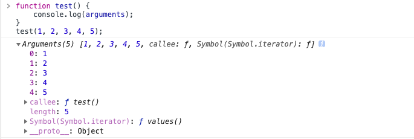

# typeof 和 instanceof

## typeof

typeof 运算符返回一个用来表示表达式的数据类型的字符串  
typeof 一般只能返回如下几个结果："number"、"string"、"boolean"、"object"、"function" 和 "undefined"

我们可以使用 typeof 来获取一个变量是否存在，如 if(typeof a!="undefined"){alert("ok")}，而不要去使用 if(a) 因为如果 a 不存在（未声明）则会出错，对于 Array, Null 等特殊对象使用 typeof 一律返回 object，这正是 typeof 的局限性。  
::::warning
运算数为数字 typeof(x) = "number"  
字符串 typeof(x) = "string"  
布尔值 typeof(x) = "boolean"  
对象,数组和 null typeof(x) = "object"  
函数 typeof(x) = "function"  
::::
经常会在 js 里用到数组,比如 多个名字相同的 input, 若是动态生成的, 提交时就需要判断其是否是数组。

```javascript
if (document.mylist.length != "undefined") {
} //这个用法有误.
```

正确的是

```javascript
if (typeof document.mylist.length != "undefined") {
}
```

或

```javascript
if (!isNaN(document.mylist.length)) {
}
```

typeof 的运算数未定义,返回的就是 "undefined"

## instanceof

instanceof 运算符用来测试一个对象在其原型链中是否存在一个构造函数的 prototype 属性。
:::warning
语法：**object** instanceof **constructor**  
参数：object（要检测的对象.）constructor（某个构造函数）  
描述：instanceof 运算符用来检测 constructor.prototype 是否存在于参数 object 的原型链上。
::::
如：

```javascript
var a = new Array();
alert(a instanceof Array); // true
alert(a instanceof Object); //也会返回 true;  这是因为 Array 是 object 的子类。
```

再如：

```javascript
function test() {}
var a = new test();
alert(a instanceof test); //会返回true
```

另外，更重的一点是 instanceof 可以在继承关系中用来判断一个实例是否属于它的父类型。

```javascript
function Foo() {}
Foo.prototype = new Aoo(); //JavaScript 原型继承
var foo = new Foo();
console.log(foo instanceof Foo); //true
console.log(foo instanceof Aoo); //true
```

上面的代码中是判断了一层继承关系中的父类，在多层继承关系中，instanceof 运算符同样适用。

```javascript
console.log(Object instanceof Object); //true
console.log(Function instanceof Function); //true
console.log(Number instanceof Number); //false
console.log(String instanceof String); //false
console.log(Function instanceof Object); //true
console.log(Foo instanceof Function); //true
console.log(Foo instanceof Foo); //false
```

```javascript
// 定义构造函数
function C() {}
function D() {}

var o = new C();

// true，因为 Object.getPrototypeOf(o) === C.prototype
o instanceof C;

// false，因为 D.prototype不在o的原型链上
o instanceof D;

o instanceof Object; // true,因为Object.prototype.isPrototypeOf(o)返回true
C.prototype instanceof Object; // true,同上

C.prototype = {};
var o2 = new C();

o2 instanceof C; // true

o instanceof C; // false,C.prototype指向了一个空对象,这个空对象不在o的原型链上.

D.prototype = new C(); // 继承
var o3 = new D();
o3 instanceof D; // true
o3 instanceof C; // true
```

谈到 instanceof 我们要多插入一个问题，就是 function 的 arguments，我们大家也许都认为 arguments 是一个 Array，但如果使用 instaceof 去测试会发现 arguments 不是一个 Array 对象，尽管看起来很像。

另外：

```javascript
var a = new Array();
if (a instanceof Object) alert("Y");
else alert("N"); //'Y'
```

但

```javascript
if (window instanceof Object) alert("Y");
else alert("N"); //'N'
```

所以，这里的 instanceof 测试的 object 是指 js 语法中的 object，不是指 dom 模型对象。

使用 typeof 会有些区别

```javascript
alert(typeof window); // "object"
```

需要注意的是，如果表达式 obj instanceof Foo 返回 true，则并不意味着该表达式会永远返回 ture，因为 Foo.prototype 属性的值有可能会改变，改变之后的值很有可能不存在于 obj 的原型链上，这时原表达式的值就会成为 false。  
另外一种情况下，原表达式的值也会改变，就是改变对象 obj 的原型链的情况，虽然在目前的 ES 规范中，我们只能读取对象的原型而不能改变它，但借助于非标准的**proto**魔法属性，是可以实现的。比如执行 obj.**proto** = {}之后，obj instanceof Foo 就会返回 false 了。

下面的代码使用了 instanceof 来证明：String 和 Date 对象同时也属于 Object 类型。

```javascript
var simpleStr = "This is a simple string";
var myString = new String();
var newStr = new String("String created with constructor");
var myDate = new Date();
var myObj = {};

simpleStr instanceof String; // returns false, 检查原型链会找到 undefined
myString instanceof String; // returns true
newStr instanceof String; // returns true
myString instanceof Object; // returns true

myObj instanceof Object; // returns true, despite an undefined prototype
({} instanceof Object); // returns true, 同上

myString instanceof Date; // returns false

myDate instanceof Date; // returns true
myDate instanceof Object; // returns true
myDate instanceof String; // returns false
```

# arguments

JS 函数中的 arguments 是一个类数组对象，它的属性名是按照传入的参数的序列来的，第一个参数的属性名是 ‘0’，第二个参数的属性名是‘1’，以此类推，并且它还有一个 ‘length’ 属性，存储的是当前传入函数参数的个数。

```js
function test() {
  console.log(arguments);
}
test(1, 2, 3, 4, 5);
```

打印结果如图：


可以看到 **arguments** 对象是怎么保存传入的参数的，同时它还保存了传入函数的实参的个数（**length**）。arguments 对象的 **\_\_proto\_\_** 是指向 object 的，这也说明了他是个类数组对象，而不是一个数组。
