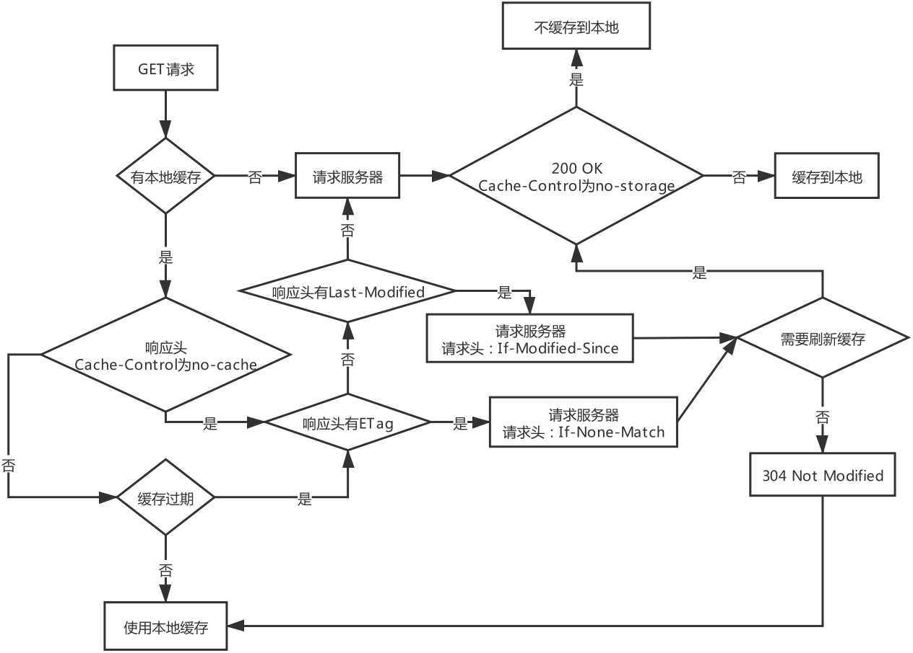

# 协议

- HTTP：HTTP/1.0 HTTP/1.1 HTTP/2 HTTP/3
- RARP
- DHCP
- WEBSOCKET
- DNS
- HTTPDNS
- FTP
- SMTP
- POP
- IMAP

# HTTP 缓存

## 响应头

**Cache-Control：** 设置缓存策略

- no-storage：不缓存数据到本地
- public：允许用户、代理服务器缓存数据到本地
- private：只允许用户缓存数据到本地
- max-age：缓存的有效时间，多长时间不过期，单位秒(例：Cache-Control: max-age=120)
- no-cache：每次需要发送请求给服务器询问缓存是否有变化，再来决定如何使用缓存

**Expires：** 缓存的过期时间（GMT 格式时间），HTTP/1.0 产物  
例：Expires: Wed, 28 Apr 2021 09:27:04 GMT

**Pragma** 作用类似 Cache-Control，HTTP/1.0 产物
:::warning
优先级：Pragma > Cache-Control > Expires
:::

**Last-Modified：** 资源的最后一次修改时间  
**etag：** 请求资源内容哈希值
:::warning
优先级：etag > Last-Modified
:::

## 请求头

**If-None-Match：** 将服务器返回的 etag 传给服务器，不匹配，返回新的资源（200 OK）,否则不返回新的资源（304 Not Modified）  
**If-Modified-Since：**如果上一次的响应头没有 etag ，有 Last-Modified，就会将 Last-Modified 的值作为请求头的值
:::warning  
**Last-Modified 缺陷：**  
1.只能精确到秒，如果资源在 1 秒内被修改了，客户端将无法获取最新的资源数据  
2.如果某些资源被修改了（最后一次修改事件发生了变化），但是内容并没有发生变化；此时如果使用 Last-Modified，服务端还是会返回资源，浪费了服务器资源
:::

## HTTP 缓存的使用流程

**以 Cache-Control 为例**

1. 本地发起 GET 请求，先查看本地是否有缓存，本地有缓存，转步骤 2，本地无缓存，转步骤 3；
2. 本地缓存响应头的 Cache-Control 是否为 no-cache，如果是 no-cache，转入步骤 4；不是，转入步骤 5；
3. 向服务器请求资源，请求资源成功，如果响应头的 Cache-Control 不为 no-storage，则将请求到的资源缓存到本地，否则不将资源缓存到本地；
4. 查看上次缓存的响应头是否有 etag，如果有 etag，则发起一个请求头带 If-None-Match，值为缓存响应头的 etag 值的请求到服务；如果上次缓存的请求头没有 etag，查看上次缓存的响应头是否有 Last-Modified，如果有 Last-Modified，则发起一个请求头带 If-Modified-Since，值为缓存响应头的 Last-Modified 值的请求到服务；服务器会根据请求的 If-None-Match 和 If-Modified-Since 判断资源是否有变更，如果没有修改则返回**304 Not Modified**；如果资源有变更，则返回**200 OK**，并将最新的资源返回；本地根据服务器返回的响应头的 Cache-Control 决定是否缓存。
5. 如果 Cache-Control 不是 max-age，则取出本地缓存的资源；如果 Cache-Control 是 max-age，判断 max-age 是否过期，如果已经过期，则转步骤 4，如果没有过期，则取出本地缓存的资源。

**流程图如下**

# 其他

WebService RESTful

# VPN

VPN 与 代理的区别

# 抓包工具

Charles

# 网络爬虫

robots.txt

# 无线网络

路由器
